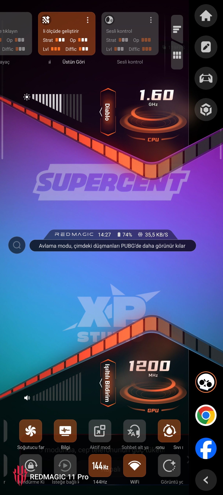
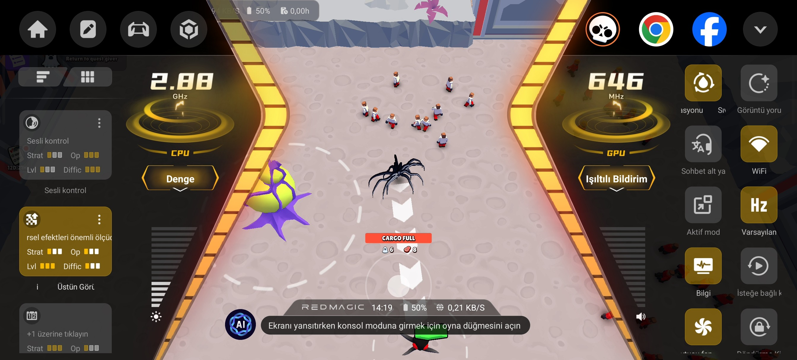
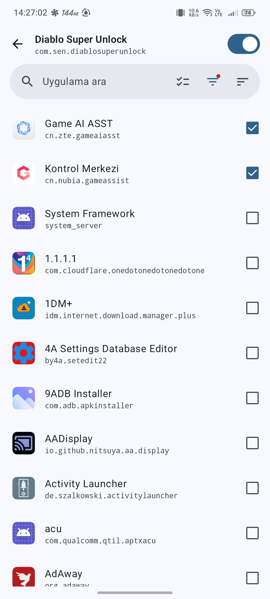

# Diablo Super Unlock

An LSPosed module for **RedMagic GameAssist** that removes the *"Please turn off Superior Pic Quality first"* restriction. Diablo mode and Superior Pic Quality (Super Resolution) can now be used **at the same time**.

## Screenshots

**Diablo mode + Superior Pic Quality:**



**Dengeli (Balance) mode + Superior Pic Quality:**



## Features

- ✅ Diablo mode + Superior Pic Quality work together
- ✅ Dengeli (Balance) mode + Superior Pic Quality work together
- ✅ Only the GameAssist check is bypassed — the actual Super Resolution stays enabled
- ✅ No system modifications, pure LSPosed hook
- ✅ Tiny footprint (~10 KB APK)

## Requirements

- Root (Magisk / KernelSU)
- LSPosed
- Android 14+ (MyOS / RedMagic OS)
- RedMagic device (tested on **NX809J / RedMagic 11 Pro**)

## Installation

1. Install the APK
2. Open **LSPosed** → **Modules** → **Diablo Super Unlock** → **Enable**
3. **Scope:** select **only** `cn.nubia.gameassist`



4. Force-stop GameAssist or reboot your device

## Usage

1. Open Game Space and launch a game
2. Enable **Superior Pic Quality** from the Game Space panel
3. Switch to **Diablo** or **Dengeli (Balance)** mode
4. Both features stay active — no more blocking toast 🎉

## Technical Details

**Hook points:**

1. `cn.nubia.gameassist.performance.PerformanceModeController`
   - Method: `isOpenSuperResolution()`
   - Behavior: Always returns `false`
   - Purpose: Bypasses the check inside `BiabloTile.handleClick()` (Diablo mode)

2. `cn.nubia.plugin.superresolution.SuperResolutionViewController`
   - Method: `isEconomizeOrBalanceMode(int)`
   - Behavior: Always returns `false`
   - Purpose: Prevents Super Resolution from being auto-disabled in Dengeli/Eko modes

3. `cn.nubia.gameassist.performance.PerformanceModeController`
   - Method: `getPerformanceMode(String)`
   - Behavior: Returns `3` instead of `5` when called from `SuperResolutionTile`
   - Purpose: Bypasses the "Please turn off Diablo mode first" toast

Example of the Diablo block we bypass:

```java
if (this.mPerformanceModeController.isOpenSuperResolution()) {
    ToastUtil.showGamemodeToast(...);
    return false; // Diablo switch was blocked here
}
```

The actual Super Resolution state is untouched — we only trick GameAssist's *check* methods.

## Build

- Android SDK 34
- AGP 8.5.2
- Gradle 8.7
- Xposed API 82 (`app/libs/api-82.jar`)
- Buildable on **Termux ARM64** with the `android.aapt2FromMavenOverride` workaround

## Warning

This module hooks into a system app. Misuse may cause bootloops or instability. Use at your own risk.

## License

MIT — see [LICENSE](LICENSE) for details.
